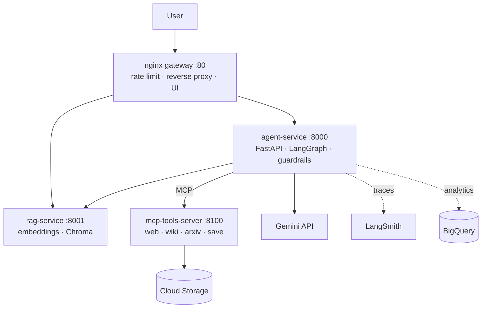

# 🧠 Agentic Research Assistant — Agentic AI on Google Cloud

A complete, production-style **multi-agent AI system**: give it a topic, and a
team of AI agents plans, researches (web/Wikipedia/arXiv via **MCP** + your own
documents via **RAG**), and writes a cited report — with **guardrails**,
**LangSmith tracing/evals**, **BigQuery analytics**, deployed as
**4 microservices** behind **nginx** on **GCP (VM → Kubernetes)** with a full
**CI/CD** pipeline.

> 📚 **Start here to understand everything:** [docs/TECHNOLOGIES.md](docs/TECHNOLOGIES.md)
> 🗺️ **Build plan & phases:** [ROADMAP.md](ROADMAP.md)

## Architecture



Agent flow: `guard_input → planner → researcher (tool loop) → summarizer → writer → guard_output → save`

## Quickstart (local, no Docker)

```powershell
python -m venv .venv
.venv\Scripts\pip install -r services/agent-service/requirements.txt `
  -r services/rag-service/requirements.txt `
  -r services/mcp-tools-server/requirements.txt -r requirements-dev.txt
copy .env.example .env        # then paste your real keys into .env (NEVER into .env.example)
powershell -File scripts/run_local.ps1
```

Try it: open http://localhost:8000/docs, or:
```bash
curl -X POST http://localhost:8000/research \
  -H "Content-Type: application/json" -H "X-API-Key: dev-secret-key" \
  -d '{"topic": "Impact of AI on the Indian job market"}'
```

## Quickstart (Docker — the real thing)

```bash
docker compose -f deploy/docker-compose.yml up --build
# open http://localhost  (frontend served by nginx)
```

## Repository map

| Path | What |
|---|---|
| `services/agent-service/` | Public API: middlewares, guardrails, LangGraph agents |
| `services/rag-service/` | Document upload → embeddings → vector search |
| `services/mcp-tools-server/` | MCP server: research tools + report saving |
| `gateway/nginx/` | nginx config + mini frontend |
| `deploy/` | docker-compose, VM script, Kubernetes manifests |
| `evals/` | LangSmith LLM-as-judge evaluation |
| `.github/workflows/` | CI/CD: lint → test → build → deploy to GKE |
| `docs/` | 📚 every technology explained for beginners |

## Testing & evaluation

```bash
cd services/agent-service && pytest tests -q     # unit tests (no keys needed)
python evals/run_evals.py                        # LLM-as-judge quality scores
```

## Deployment journey (see docs 09–12)

1. **Local** — docker-compose (free)
2. **Compute Engine VM** — nginx as the only open port, keyless IAM via service account
3. **GKE Kubernetes** — replicas, load balancer, autoscaling, self-healing
4. **CI/CD** — GitHub Actions → Artifact Registry → GKE, with eval quality gates

⚠️ Learning project: create GCP resources, screenshot, then tear down
([ROADMAP.md §6](ROADMAP.md) cost control).
