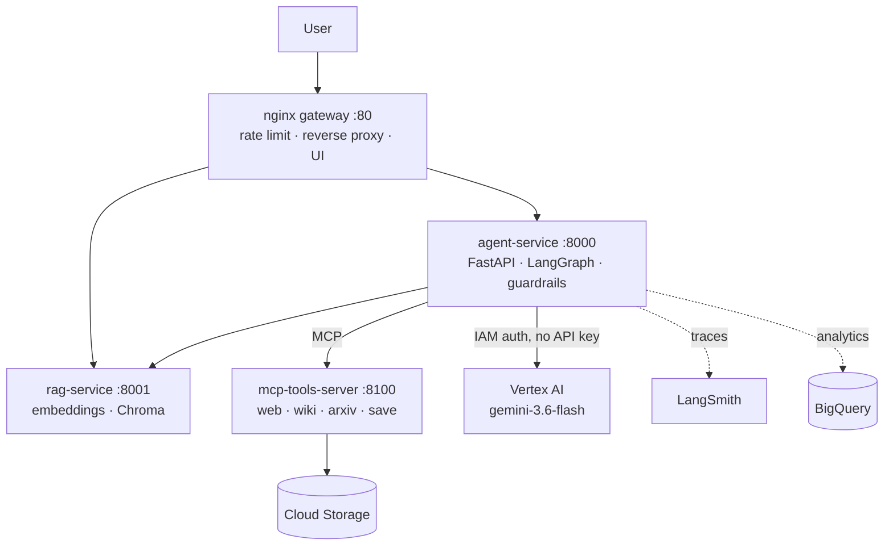
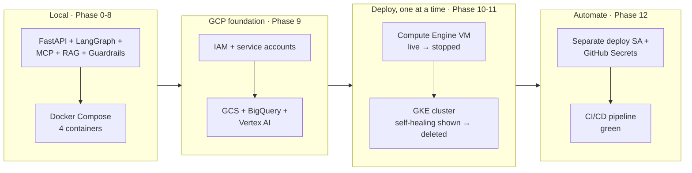
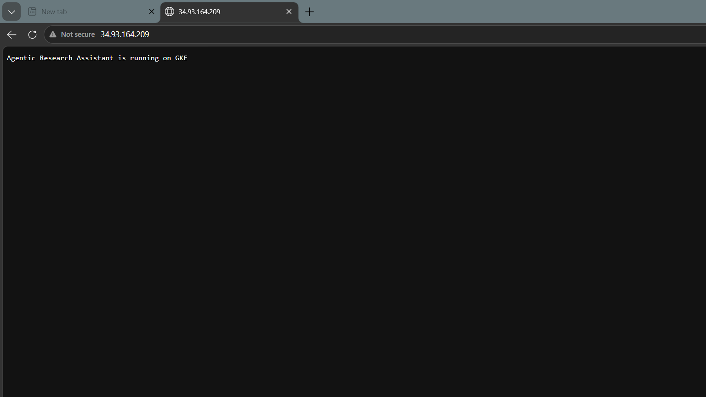
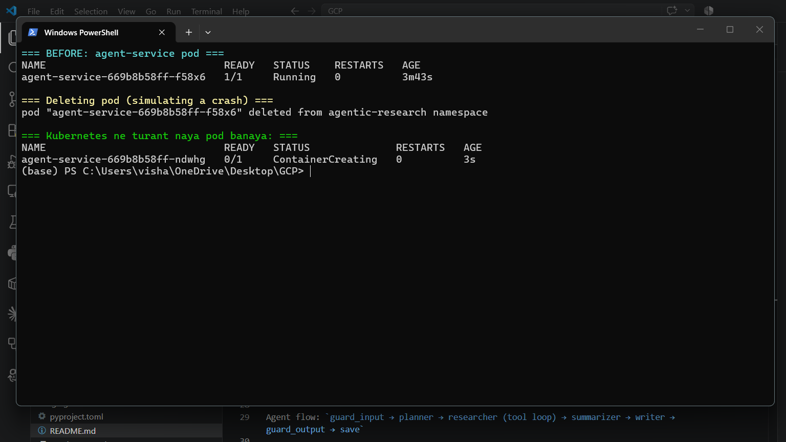
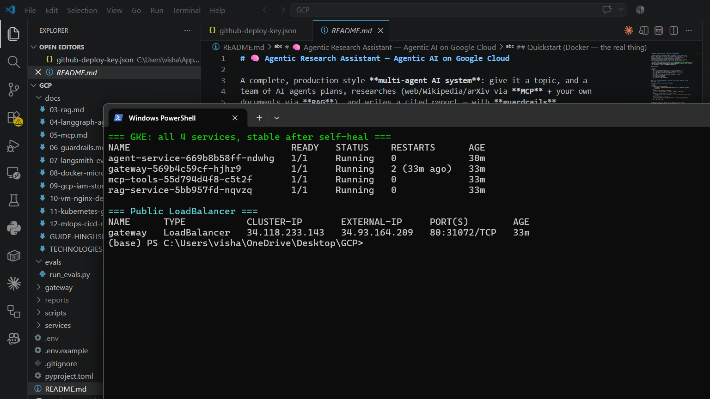
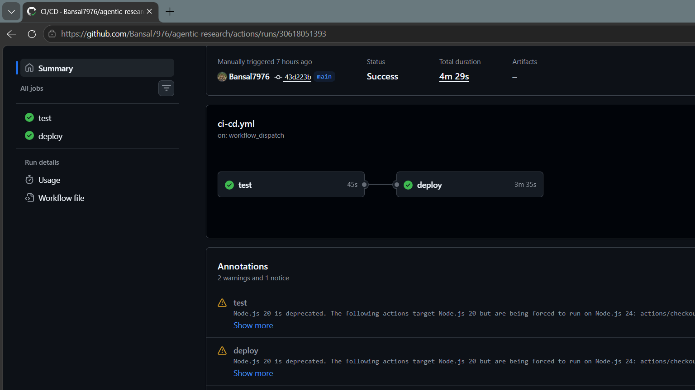

# 🧠 Agentic Research Assistant — Agentic AI on Google Cloud

A complete, production-style **multi-agent AI system**: give it a topic, and a
team of AI agents plans, researches (web/Wikipedia/arXiv via **MCP** + your own
documents via **RAG**), and writes a cited report — with **guardrails**,
**LangSmith tracing/evals**, **BigQuery analytics**, deployed as
**4 microservices** behind **nginx** on **GCP (VM → Kubernetes)** with a full
**CI/CD** pipeline. Auth throughout is **IAM-based, not API keys** — Vertex AI,
Cloud Storage and BigQuery are all reached via service-account identity.

> 📚 **Start here to understand everything:** [docs/TECHNOLOGIES.md](docs/TECHNOLOGIES.md) (reference) · [docs/GUIDE-HINGLISH.md](docs/GUIDE-HINGLISH.md) (learning guide, Hinglish)
> 🗺️ **Build plan & phases:** [ROADMAP.md](ROADMAP.md)

## Architecture



Agent flow: `guard_input → planner → researcher (tool loop) → summarizer → writer → guard_output → save`

## Deployment journey — verified at every stage



Each stage was actually run against live GCP resources, not just written —
see [ROADMAP.md](ROADMAP.md) for phase-by-phase status and
[docs/GUIDE-HINGLISH.md](docs/GUIDE-HINGLISH.md) for the *why* behind every step,
including the real problems hit along the way (e.g. GKE pods stuck `Pending` on
`Insufficient cpu`, fixed by right-sizing resource requests).

**Live evidence:**
- ✅ Compute Engine VM (`agentic-vm`, e2-medium, `34.93.125.121`) served a real research request over the public internet — 10 sources found, report written to `gs://agentic-reports-81536/reports/how-does-the-kumbh-mela-logistics-work-...md` (8.7KB, verified in Cloud Storage) — then the VM was deleted
- ✅ GKE cluster (`agentic-cluster`, 2×e2-medium) served requests through a GCP LoadBalancer (`34.93.164.209`); the `agent-service` pod was deleted mid-run and Kubernetes had a replacement `ContainerCreating` within 3 seconds, `Running` within a minute — then the cluster was deleted
- ✅ CI/CD pipeline ran green end-to-end: [Actions run #8](https://github.com/Bansal7976/agentic-research/actions/runs/30618051393) — lint, tests, and all 3 images built + pushed to Artifact Registry via a scoped deploy service account (zero long-lived keys on the runtime side)

### Screenshots — captured live, same session

| | |
|---|---|
| **App running on GKE**, served through the GCP LoadBalancer |  |
| **Self-healing, moment 1** — pod deleted, replacement already `ContainerCreating` 3s later |  |
| **Self-healing, moment 2** — all 4 services back to `Running`, LoadBalancer unaffected throughout |  |
| **CI/CD pipeline**, publicly viewable — test + build + push, green |  |

## Quickstart (local, no Docker)

```powershell
python -m venv .venv
.venv\Scripts\pip install -r services/agent-service/requirements.txt `
  -r services/rag-service/requirements.txt `
  -r services/mcp-tools-server/requirements.txt -r requirements-dev.txt
copy .env.example .env        # then paste your real keys into .env (NEVER into .env.example)
powershell -File scripts/run_local.ps1
```

Try it: open http://localhost:8000/docs, or:
```bash
curl -X POST http://localhost:8000/research \
  -H "Content-Type: application/json" -H "X-API-Key: dev-secret-key" \
  -d '{"topic": "Impact of AI on the Indian job market"}'
```

## Quickstart (Docker — the real thing)

```bash
docker compose -f deploy/docker-compose.yml up --build
# open http://localhost  (frontend served by nginx)
```

## Repository map

| Path | What |
|---|---|
| `services/agent-service/` | Public API: middlewares, guardrails, LangGraph agents |
| `services/rag-service/` | Document upload → embeddings → vector search |
| `services/mcp-tools-server/` | MCP server: research tools + report saving |
| `gateway/nginx/` | nginx config + mini frontend |
| `deploy/` | docker-compose, VM script, Kubernetes manifests |
| `evals/` | LangSmith LLM-as-judge evaluation |
| `.github/workflows/` | CI/CD: lint → test → build → deploy to GKE |
| `docs/` | 📚 every technology explained for beginners |

## Testing & evaluation

```bash
cd services/agent-service && pytest tests -q     # unit tests (no keys needed)
python evals/run_evals.py                        # LLM-as-judge quality scores
```

## Deployment journey (see docs 09–12)

1. **Local** — docker-compose (free)
2. **Compute Engine VM** — nginx as the only open port, keyless IAM via service account
3. **GKE Kubernetes** — replicas, load balancer, autoscaling, self-healing
4. **CI/CD** — GitHub Actions → Artifact Registry → GKE, with eval quality gates

## Current live state

| Resource | Status |
|---|---|
| Compute Engine VM | 🔴 deleted (instance + disk — re-verified live, screenshotted, then fully torn down) |
| GKE cluster | 🔴 deleted (re-verified live incl. self-healing, screenshotted, then fully torn down) |
| Artifact Registry images | 🟢 present — `agent-service`, `rag-service`, `mcp-tools`, latest via CI |
| Cloud Storage / BigQuery | 🟢 live, near-zero cost at this data volume |
| CI/CD pipeline | 🟢 green — re-run "Run workflow" any time; auto-deploys if a cluster exists |

⚠️ Learning project: this repo is built to be **stood up, verified, and torn
down on demand** rather than left running — see [ROADMAP.md §6](ROADMAP.md)
for cost control and the teardown checklist.
