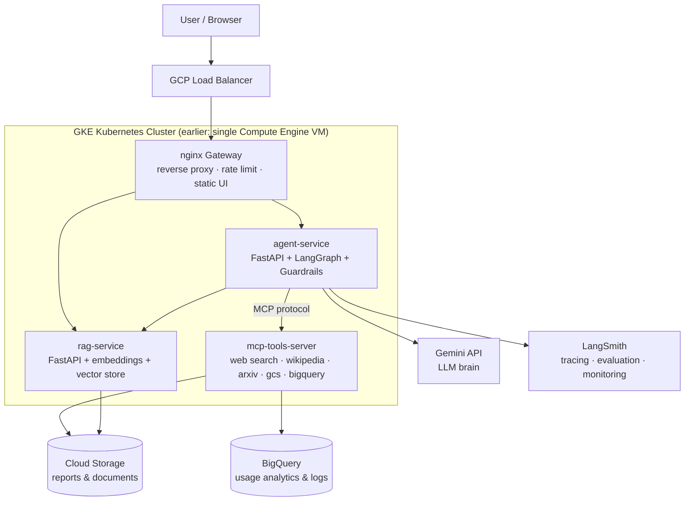
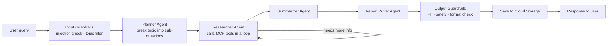

# 🧠 Agentic Research Assistant — Full-Stack Agentic AI on Google Cloud

> **Goal of this project:** Learn the COMPLETE modern Agentic AI stack by building one real
> project end-to-end — from writing the first FastAPI endpoint to running a multi-agent
> system on Kubernetes in Google Cloud — and document every technology so well that
> anyone reading this repo understands exactly how everything works.

---

## 1. What we are building

An **AI Research Assistant**: you give it a topic, and a team of AI agents plans the
research, searches the web, reads sources, summarizes findings, and writes a final
report — which gets saved to Cloud Storage. Every request is guarded (input/output
guardrails), traced (LangSmith), logged (BigQuery), and served through a proper
production setup (nginx → FastAPI microservices → Kubernetes on GCP).

**Example:** `POST /research {"topic": "Impact of AI on Indian job market"}`
→ Planner agent breaks it into sub-questions
→ Researcher agent uses MCP tools (web search, Wikipedia, arXiv) to gather info
→ Writer agent produces a structured report
→ Report saved to Cloud Storage, analytics logged to BigQuery, full trace in LangSmith.

---

## 2. Architecture (final state)



### The LangGraph agent flow (inside agent-service)



---

## 3. Complete technology stack & the role of each

| Technology | Role in THIS project | What you learn |
|---|---|---|
| **Python 3.12 + FastAPI** | All backend microservices | Async APIs, Pydantic validation, dependency injection |
| **FastAPI Middlewares** | Auth, request-ID, timing, rate-limit, error handling, CORS | How every request is intercepted & processed |
| **LangChain** | LLM calls, prompts, output parsers, RAG chains | The standard LLM app toolkit |
| **LangGraph** | Multi-agent orchestration (Planner → Researcher → Writer) | State machines, conditional edges, checkpoints, agent loops |
| **Gemini API** | The LLM brain (free tier) | Chat, structured output, function calling, embeddings |
| **MCP (Model Context Protocol)** | Separate tools server the agent connects to | The open standard for giving agents tools |
| **Guardrails** | Input: prompt-injection/topic filter · Output: PII/safety | Making agents safe for production |
| **RAG (vector store)** | User-uploaded docs → embeddings → retrieval | Chunking, embeddings, similarity search |
| **LangSmith** | Tracing every agent step, eval datasets, LLM-as-judge, dashboards | Observability + evaluation ("MLOps for LLMs") |
| **nginx** | Reverse proxy, load balancing, rate limiting, static frontend | How real traffic reaches your services |
| **Docker + docker-compose** | Each microservice in its own container | Images, layers, networking, compose |
| **Google Compute Engine (VM)** | First deployment target | SSH, firewall rules, systemd, Linux server basics |
| **Google IAM** | Service accounts, least-privilege roles, workload identity | Cloud security fundamentals |
| **Cloud Storage (GCS)** | Reports + uploaded documents | Buckets, objects, signed URLs, lifecycle rules |
| **BigQuery** | Request/usage/latency analytics | Datasets, tables, SQL analytics, streaming inserts |
| **GKE (Kubernetes)** | Final deployment target | Deployments, Services, Ingress, HPA, ConfigMaps, Secrets |
| **Cloud Load Balancing** | Global HTTP(S) LB via GKE Ingress | L7 load balancing, health checks |
| **Artifact Registry** | Stores our Docker images | Image registries, tagging, versioning |
| **GitHub Actions (CI/CD)** | Test → evaluate → build → push → deploy pipeline | Real MLOps automation |
| **Cloud Monitoring/Logging** | Uptime checks, dashboards, alerts | Production monitoring |
| **Microservices architecture** | 4 independent services talking over HTTP/MCP | Why & how to split systems |

---

## 4. Planned repository structure

```
GCP/
├── ROADMAP.md                  ← this file
├── README.md                   ← project overview + quickstart (Phase 1)
├── docs/                       ← 📚 the "explain everything" documentation
│   ├── 01-fastapi-and-middlewares.md
│   ├── 02-langchain-gemini.md
│   ├── 03-rag.md
│   ├── 04-langgraph-agents.md
│   ├── 05-mcp.md
│   ├── 06-guardrails.md
│   ├── 07-langsmith-evaluation.md
│   ├── 08-docker-microservices.md
│   ├── 09-gcp-iam-storage-bigquery.md
│   ├── 10-vm-nginx-deployment.md
│   ├── 11-kubernetes-gke.md
│   ├── 12-mlops-cicd-monitoring.md
│   └── TECHNOLOGIES.md         ← master file linking all of the above
├── services/
│   ├── agent-service/          ← FastAPI + LangGraph + guardrails
│   ├── rag-service/            ← FastAPI + embeddings + vector store
│   └── mcp-tools-server/       ← MCP server with all tools
├── gateway/
│   └── nginx/                  ← nginx config + simple frontend
├── deploy/
│   ├── docker-compose.yml      ← local: run everything together
│   ├── vm/                     ← Compute Engine setup scripts
│   └── k8s/                    ← Kubernetes manifests
├── evals/                      ← LangSmith evaluation datasets & scripts
└── .github/workflows/          ← CI/CD pipelines
```

---

## 5. The Phases (build order)

Each phase = build something working + a `docs/` file explaining the technology
in beginner-friendly language. Don't skip phases — each builds on the previous one.

### 🟢 Phase 0 — Setup (½ day)
- Install: Docker Desktop, gcloud CLI (Python 3.12 ✅ and Git ✅ already installed)
- Get API keys: **Gemini** (aistudio.google.com — free), **LangSmith** (smith.langchain.com — free), **Tavily** (web search — free tier)
- Create GCP account → **set a billing alert immediately** (₹500) → new project `agentic-research`
- **Learn:** what each tool is for, GCP console tour, free tier limits

### 🟢 Phase 1 — FastAPI foundation + middlewares (1–2 days)
- Project skeleton, virtual env, `agent-service` with health/`/research` stub endpoints
- Middlewares one by one: CORS → request-ID → timing/logging → API-key auth → rate limiting → global error handler
- Pydantic request/response models, config via `.env`
- **Learn:** how a request flows through middlewares before hitting your endpoint

### 🟢 Phase 2 — LangChain + Gemini (1–2 days)
- First LLM call, prompt templates, structured output (Pydantic parsers), streaming
- Wire it into `/research`: single-LLM version (no agents yet)
- **Learn:** prompts, tokens, temperature, structured output, why LangChain exists

### 🟢 Phase 3 — RAG + rag-service (2 days)
- Second microservice: upload document → chunk → Gemini embeddings → Chroma vector store → retrieval endpoint
- agent-service calls rag-service over HTTP (first taste of microservices!)
- **Learn:** embeddings, chunking strategies, similarity search, service-to-service calls

### 🟢 Phase 4 — LangGraph multi-agent system (2–3 days)
- Replace single LLM call with a **graph**: Planner → Researcher (tool loop) → Summarizer → Writer
- Shared state, conditional edges, checkpointer (conversation memory)
- **Learn:** why LangGraph > plain chains, agent state machines, ReAct loops

### 🟢 Phase 5 — MCP tools server (2 days)
- Third microservice: MCP server exposing `web_search`, `wiki_lookup`, `arxiv_search`, `save_report`, `query_analytics`
- agent-service connects as MCP client (langchain-mcp-adapters)
- **Learn:** what MCP is, why an open tool protocol matters, client-server tool calling

### 🟢 Phase 6 — Guardrails (1–2 days)
- Input guardrails node: prompt-injection detection, off-topic filter, length limits
- Output guardrails node: PII scrubbing, safety check, format validation
- **Learn:** LLM attack surface, defense-in-depth for agents

### 🟢 Phase 7 — LangSmith: tracing + evaluation (2 days)
- Turn on tracing (see every agent step visually), tag runs with request-IDs
- Build an eval dataset (topics + expected qualities), LLM-as-judge evaluators (relevance, groundedness, completeness), run experiments
- **Learn:** observability, systematic evaluation instead of "looks good to me"

### 🟡 Phase 8 — Docker + microservices locally (2 days)
- Dockerfile per service (multi-stage builds), docker-compose runs everything: nginx + 3 services
- nginx config: reverse proxy, routing, rate limiting, serving a minimal frontend page
- **Learn:** containers, images, compose networking, nginx fundamentals

### 🟡 Phase 9 — GCP foundations: IAM, Storage, BigQuery (2 days)
- gcloud CLI setup, service accounts with least-privilege roles
- GCS bucket for reports (code now saves real files), BigQuery dataset for request logs (middleware now streams real analytics), run analysis SQL
- **Learn:** IAM roles vs service accounts vs keys, buckets, BigQuery basics

### 🟡 Phase 10 — Deploy to a Compute Engine VM (2 days)
- Create VM (e2-small), SSH, install Docker, firewall rules (only 80/443 open)
- Deploy via docker-compose, nginx as the only public entry point, attach service account (no key files!)
- **Learn:** Linux server ops, VM networking, firewall, IAM in practice
- **⚠️ Stop the VM when not using it — this is where billing starts**

### 🔴 Phase 11 — Kubernetes on GKE (3–4 days)
- Push images to Artifact Registry
- GKE Autopilot cluster: Deployments, Services, ConfigMaps, Secrets, Ingress (= GCP Load Balancer), HPA autoscaling, rolling updates
- Kill a pod and watch Kubernetes heal it 🙂
- **Learn:** every core Kubernetes concept, hands-on
- **⚠️ Most expensive phase — create cluster, learn, screenshot, DELETE cluster**

### 🔴 Phase 12 — MLOps: CI/CD + monitoring (2–3 days)
- GitHub Actions: on push → lint + tests + **LangSmith eval gate** → build images → push to Artifact Registry → deploy to GKE
- Cloud Monitoring dashboard + uptime check + alert; BigQuery cost/usage analytics queries
- **Learn:** the full MLOps loop — code change to production automatically, with quality gates

### 🔵 Phase 13 — Documentation + teardown (1–2 days)
- Finish `docs/TECHNOLOGIES.md` (master explainer), polish README with architecture diagrams and screenshots of GCP console/K8s/LangSmith
- **Teardown guide:** delete cluster, VM, images; keep only GCS + BigQuery (free tier) — bill → ₹0
- **Result:** a portfolio project anyone can read and fully understand

---

## 6. Cost control (IMPORTANT — read twice)

This is a learning project. You build it once, screenshot everything, then tear down.

1. **Day 1:** create a billing alert at ₹500 in GCP before anything else.
2. GCP gives **$300 free credit for 90 days** to new accounts — the whole project fits in it easily.
3. Gemini API, LangSmith, Tavily: all have free tiers — ₹0.
4. Phases 0–9 cost ~₹0 (everything runs locally; GCS/BigQuery free tier).
5. VM (Phase 10): **stop it** whenever you're not actively using it.
6. GKE (Phase 11): create → learn → **delete the same week**.
7. Phase 13 teardown checklist brings the bill back to ₹0 permanently.

---

## 7. Rules we follow while building

1. **One phase at a time.** A phase is done only when its code runs AND its `docs/` file is written.
2. **Every technology gets explained** in `docs/` in simple language — what it is, why we need it, how OUR code uses it, and what would break without it.
3. **Commit after every phase** with clear messages — the git history itself becomes a tutorial.
4. **No secrets in git.** API keys live in `.env` (gitignored) locally, Secret Manager/K8s Secrets in cloud.

---

*Current status: ✅ Phases 0–10 DONE & verified — full stack live on a Compute
Engine VM (nginx → 3 microservices in Docker, Vertex AI via attached service
account, reports → GCS, analytics → BigQuery). Next: Phase 11 (GKE) + 12 (CI/CD).
⚠️ Remember: stop the VM when not in use.*
